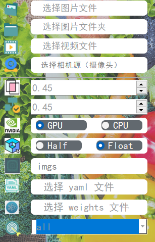
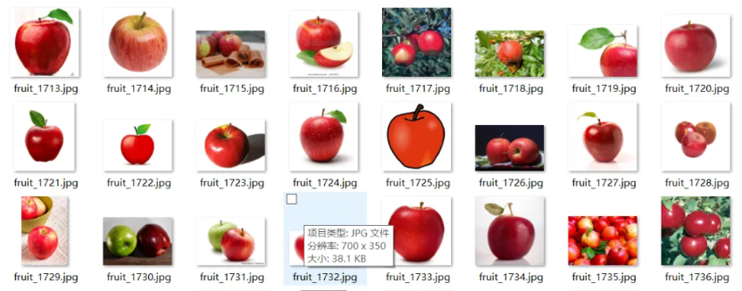
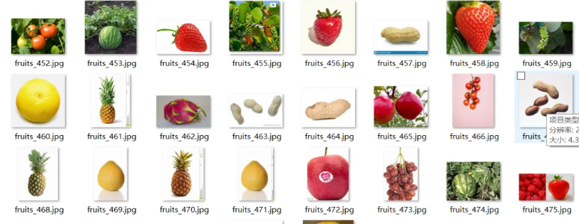
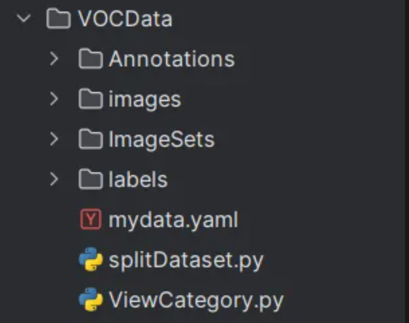

前言：

蔬菜水果的种类繁多，是人们日常生活中不可或缺的一部分。然而，在蔬菜水果的生产、销售和储存过程中，
往往面临着诸多挑战，如品质检测、分类等问题。为了提高蔬菜水果行业的生产效率和产品质量，我们提出
了基于深度学习技术的蔬菜水果检测系统。

本项目采用了Yolov8算法，这是一种高效的目标检测算法，能够在图像中快速准确地检测出各种目标。 我
们 将其应用于蔬菜水果的检测，旨在实现对蔬菜水果的自动化检测和识别。

数据集的选择是本项目成功的关键之一。我们收集了大量的蔬菜水果图像，并对其进行了详细的标注， 涵盖
了27种常见蔬菜水果的不同品种和形态。这些数据为模型的训练提供了充分的支持，确保了模型在各种情况
下的准确性和稳定性。

在训练过程中，我们采用了迁移学习的方法，利用预训练的Yolov8模型，并结合我们的蔬菜水果数据集进行
了进一步的微调和优化。通过这种方式，我们成功地提高了模型在蔬菜水果检测任务上的性能和准确率。

本项目的最终目标是将训练好的模型应用于实际场景中，帮助蔬菜水果行业实现自动化生产和管理，提高产
品品质和市场竞争力。我们相信，这一技术的应用将为蔬菜水果行业带来新的发展机遇，并推动行业向智能化、高效化方向迈进。

基于此项目，设计一个使用Pyqt5库来搭建页面展示系统。本系统支持的功能包括训练模型的导入、初始化；
置信度与IOU阈值的调节、图像上传、检测、可视化结果展示、结果导出与结束检测；
视频的上传、检测、可视化结果展示、结果导出与结束检测；摄像头的上传、检测、可视化结果展示与结束检测；已检测目标信息列表、位置信息；以及推理用时

优势：

多样性和准确性：使用27类蔬菜水果数据集进行训练，使得模型能够准确识别各种形态和品种的蔬菜水果，具有较高的检测准确性和覆盖范围。

应用广泛：本项目不仅限于某一特定品种或场景，而是涵盖了蔬菜水果行业的广泛领域，可应用于农业生产、仓储物流、超市零售等多个环节。

智能化管理：将蔬菜水果检测技术应用于生产和销售环节，可以实现自动化检测和管理，提高生产效率和产品质量，降低人力成本和风险。

应用前景：

农业生产：在蔬菜水果的种植和采摘过程中，利用检测技术进行品质检测和分类，提高农产品的品质和市场竞争力。

仓储物流：在蔬菜水果的仓储和物流环节中，通过检测技术实现自动化分类和管理，提高仓储效率和产品保鲜度。

超市零售：在超市销售环节中，利用检测技术对蔬菜水果进行品质检测和分类，提高产品陈列和销售效率，增强顾客体验和满意度。

一、软件核心功能介绍及效果演示
软件主要功能
支持图片、图片批量、视频及摄像头进行检测，同时摄像头可支持 内置摄像头和外设摄像头；
对检测结果进行单独分析，并且显示单个检测物体的坐标、置信度等;
界面可实时显示目标位置、检测结果、检测时间、置信度、检测结果回滚等信息;
支持图片、视频及摄像头的结果保存，将检测结果保持为excel文件；

界面参数设置说明:

图片检测演示
点击打开图片按钮，选择需要检测的图片，或者点击打开文件夹按钮，选择需要批量检测图片所在的文件夹，操作演示如下：
点击表格中的指定行，界面会显示该行表格所写的信息内容。
视频检测演示
点击视频按钮图标，打开选择需要检测的视频，在点击开始运行会自动显示检测结果。再次点击停止按钮，会停止检测视频。
点击表格中的指定行，界面会显示该行表格所写的信息内容。

四、模型的训练、评估与推理
数据集准备
本文使用的蔬菜水果数据集共包含2013张图片，一共有27类，分别为['黑葡萄', '绿葡萄', '樱桃', '西瓜', '龙眼', '香蕉', '芒果', '菠萝', '柚子', '草莓', '苹果', '柑橘', '火龙果', '梨子', '花生', '黄瓜', '土豆', '大蒜', '茄子', '白萝卜', '辣椒', '胡萝卜', '花菜', '白菜', '番茄', '西蓝花', '橙子']。部分数据集及类别信息如下：

图片数据集的存放格式如下，在项目目录中新建VOCData目录，同时将图片放入 images 目录下。

运行splitDataset.py，用于划分数据集；

运行xml2txt.py，用于得到训练标注文件；

运行ViewCategory.py，用于查看一共有那些类别；

mydata.yaml，用于填写模型训练的数据配置文件。

注意：在xml2txt.py和mydata.yaml中的类别名称的顺序要一致。